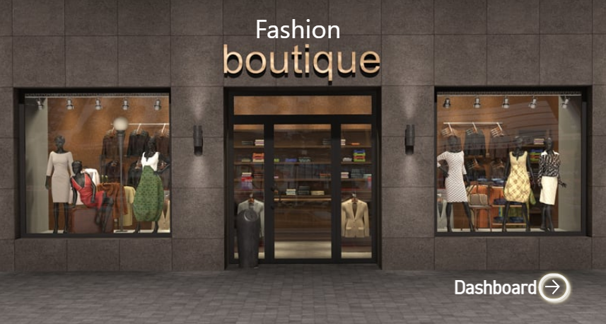
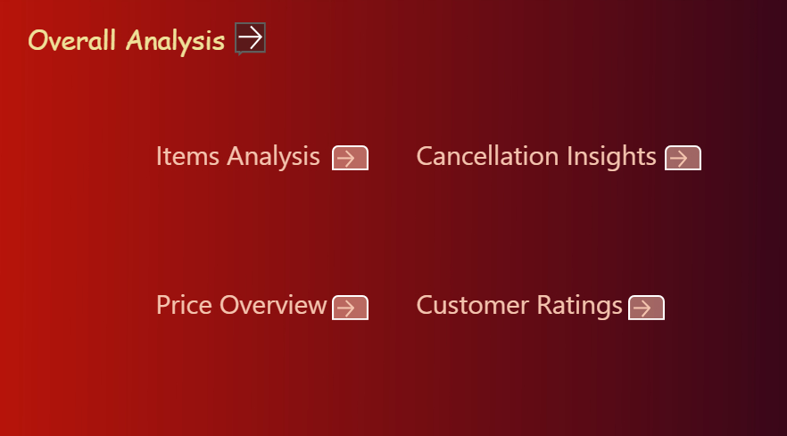
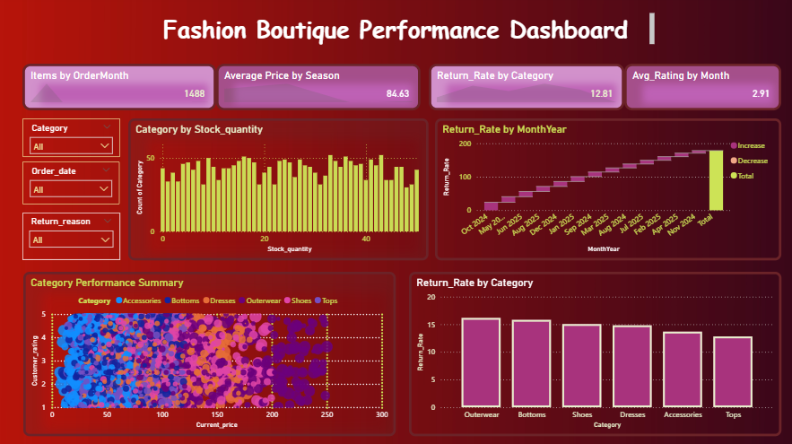
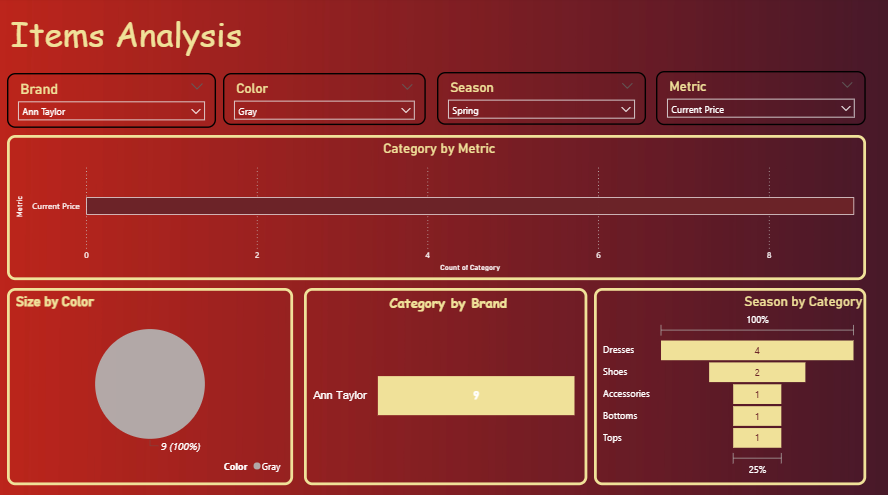
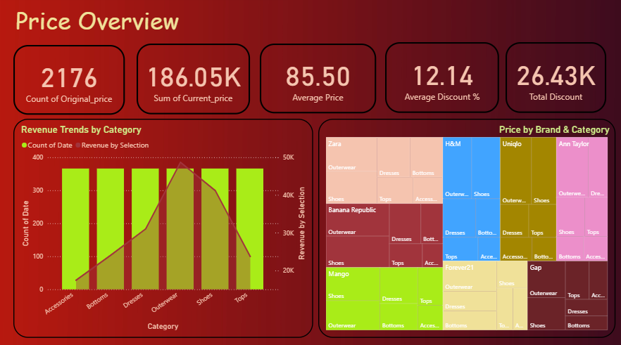
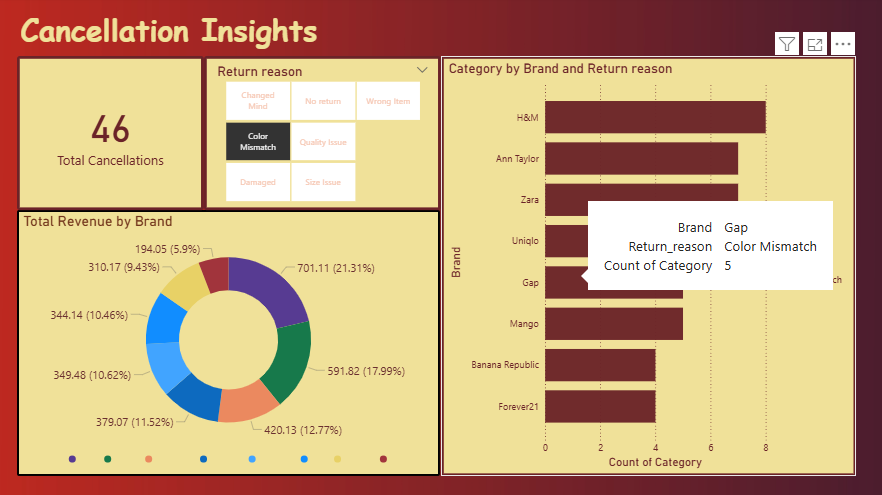
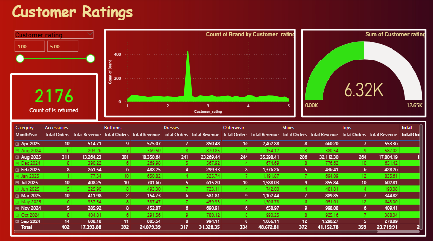

# fashion-boutique-analysis
Sales and customer insights dashboard
# Fashion Boutique Sales & Customer Insights Dashboard

## Project Overview
This project analyzes sales performance and customer behavior of a fashion boutique using Power BI.

## Tools Used
- Power BI
- Excel
- DAX

## Key Insights
- Monthly and yearly sales trends
- Top-selling products
- Customer purchase patterns
- Revenue contribution by category

## KPIs
- Total Sales
- Total Orders
- Average Order Value
- Customer Count

## Dataset
Sample fashion boutique sales dataset (Excel)

## Dashboard Preview
Screenshots added below.
## Dashboard Screenshots

## Dashboard Screenshots

